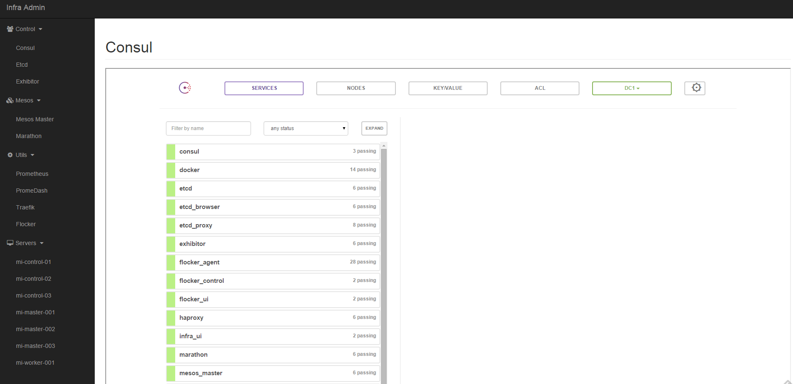

This is mirror of [MANTL](https://github.com/CiscoCloud/microservices-infrastructure)

[](http://slack.lycandev.com)

# Changes from the original repo:

* instance group, separate coordination services with mesos
  Now have control, master, worker
* use ubuntu as base
* use supervisord instead of systemd
* Only Tested on **aws**
* Remove the security certificates. (So doesn't work for cross dc setup. Need to be added)
* Far away from completed

# Components included

* docker (1.9.1)
* mesos (0.25.0)
* marathon (0.11.1)
* traefik
* prometheus
* etcd
* consul
* exhibitor
* flocker
* openvpn

# Setup the the infra

* Make sure you have following package installed

  * ansible
  * terraform

* Clone the code

* Run env setup

```bash
$ make buildenv
```

* Config you cluster 

```bash
cp infra.sample.yml infra.yml
# Modify infra.yml accordingly
```

* Run setup scripts

```bash
$ source bin/activate
$ ./security-setup
$ ./flocker-security-setup $YOUR_CLUSTER_NAME
$ python infra/infra-setup.py infra.yml
```

* Setup infra with terraform

```bash
$ terraform get
$ terraform plan
$ terraform apply
```

* Provisioning your infra with ansible

```bash
ansible-playbook \
  -i plugins/inventory/terraform.py \
  -e @security.yml \
  -e @cluster.yml \
  infra_ansible.yml 
```

* Provisioning openvpn with ansible

```bash
ansible-playbook \
  -i plugins/inventory/terraform.py \
  -e @security.yml \
  -e @cluster.yml \
  openvpn_ansible.yml 
```

You can find out your openvpn client config/certs on the openvpn server host
/etc/openvpn/keys/your-key-name.tar.gz

* Sync all the config files and terraform states files to s3

```bash
# You should have aws cli installed and configured.
./sync_important_to_s3.sh s3://some_bucket/some_prefix
```

# Destroy created infra

```bash
$ terraform destroy
```

# Example infra.yml

```yaml
---
# AWS config
aws_region: us-east-1
aws_zone: us-east-1d
control_instance_type: t2.medium
master_instance_type: t2.medium
worker_instance_type: t2.medium
aws_ami: ami-d05e75b8
aws_instance_role: "rdp_s3_full"
control_count: 3
master_count: 3
worker_count: 1
ssh_key: "~/.ssh/id_rsa.pub"

# Route53 settings
route53_zone_id: "XXXXX"
domain: "YOUR_DOMAIN"

# Deployment 
cluster_name: mi
exhibitor_s3_bucket: "bigdata-tmp"
exhibitor_config_prefix: "zk-config-mi"
cluster_type: mesos

# VPN
openvpn_enabled: yes
openvpn_key_country: US
openvpn_key_province: CA
openvpn_key_city: LA
openvpn_key_org: your_companry
openvpn_key_email: your_email
openvpn_use_pam: yes
openvpn_clients: [mi]
openvpn_use_pam_users:
  - { name: yourname, password: yourpassword }

# Slack config for prometheus alerting
slack_webhook_url: "https://xxx.slack.com/xxx"
slack_channel: "#alert"
```

# Checkout the Dashboard

You can check out the infra dashboard on http://clustername-control-01.domain.com:7070


